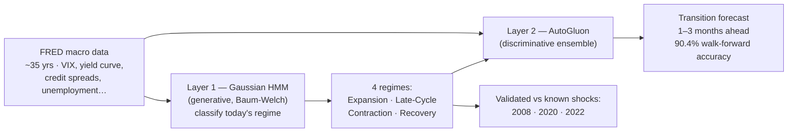

# 🌐 MacroScope

**Live demo (nothing to install): https://macroscope-red.vercel.app**

## What is this?

The economy moves through repeating phases — strong growth (**Expansion**), the overheated
end of a boom (**Late-Cycle**), downturns (**Contraction**), and the climb back out
(**Recovery**). Investors care enormously about which phase we're in, because stocks, bonds,
and commodities behave very differently in each one. The problem: nobody rings a bell when
the phase changes.

MacroScope is a dashboard that reads official U.S. economic data (unemployment, industrial
production, interest-rate spreads, and more from the Federal Reserve's public database) and uses
two different kinds of machine learning to answer two questions:

1. **"Which phase are we in right now?"** — answered by a Hidden Markov Model, a statistical
   technique that infers hidden states from noisy signals (the same family of math behind early
   speech recognition)
2. **"Which phase comes next?"** — answered by AutoGluon, an ensemble of modern ML models that
   forecasts the probability of transitioning to each phase 1–3 months ahead

Think of it as a weather forecast, but for the economy: today's conditions, plus the probability
of a storm next month — with every chart explained in plain language on the page itself.

## What you can do with it

- **See today's regime** on a live dashboard (Bloomberg Terminal aesthetic)
- **Scroll through history** — regime bands overlaid on S&P 500 returns, so you can see how past
  recessions were flagged
- **Read transition forecasts** — probability of moving to each regime, with confidence intervals
- **Check asset implications** — how each asset class historically performed in each regime
- **Learn the methodology** — a full non-quant explanation is built into the site

---

## Run it on your own computer

You'll need three free things installed (one-time setup):

1. **Node.js** — the "LTS" version from [nodejs.org](https://nodejs.org)
2. **Python 3.11+** — from [python.org/downloads](https://python.org/downloads)
3. **Git** — from [git-scm.com](https://git-scm.com)

Open a terminal (Mac: `Cmd+Space`, type "Terminal") and paste these one at a time:

```bash
git clone https://github.com/shravanA-git/macroscope.git
cd macroscope
pip install -r requirements.txt
```

**Optional but recommended — a free FRED API key** (FRED is the Federal Reserve's public data
service). Get one in ~2 minutes at
[fred.stlouisfed.org/docs/api/api_key.html](https://fred.stlouisfed.org/docs/api/api_key.html),
then:

```bash
cp .env.example .env
```

…and paste your key into the `FRED_API_KEY=` line using any text editor. (The app works without
it, but the key removes rate limits.)

**Start the backend** (in this terminal):

```bash
uvicorn api.index:app --port 8000 --reload
```

**Start the frontend** (open a *second* terminal window):

```bash
cd macroscope/frontend
npm install
npm run dev
```

Open http://localhost:3000 in your browser. That's it.

> **Something not working?** Make sure both terminals are still running (backend on port 8000,
> frontend on 3000), and that you ran the `npm` commands inside the `frontend` folder.

---

## How it works (for the quantitatively curious)



**Layer 1 — HMM (Generative):** Classifies the current macro regime (Expansion / Late-Cycle /
Contraction / Recovery) from FRED macro indicators using the Baum-Welch algorithm.

**Layer 2 — AutoGluon (Discriminative):** Predicts regime transitions 1–3 months ahead using the
same feature set. The publishable comparison: generative vs. discriminative for regime
forecasting.

## Stack

- **Backend:** Python (hmmlearn, AutoGluon, FastAPI) → Vercel serverless functions
- **Frontend:** Next.js App Router + Tailwind + Recharts
- **Data:** FRED API, yfinance
- **Deployment:** Vercel

## Structure

```
macroscope/
├── backend/
│   ├── data/         # FRED pipeline, feature engineering
│   ├── models/       # HMM, AutoGluon, backtesting
│   ├── api/          # FastAPI endpoints
│   └── tests/        # Unit + integration tests
├── api/              # Vercel Python entry point
├── frontend/         # Next.js App Router
├── research/
│   ├── notebooks/    # EDA, validation, figures
│   ├── figures/      # Generated charts for paper
│   └── paper/        # Zenodo draft
└── data/             # Cached FRED pulls (.gitignored, regenerated on demand)
```

## Research paper

Target: Zenodo preprint before September 2026.
Topic: *Generative vs. Discriminative Approaches to Macroeconomic Regime Transition Forecasting*

---

Built by Shravan Anand · Duke University · CS + Economics. *Not investment advice — MacroScope is
an academic research project.*
